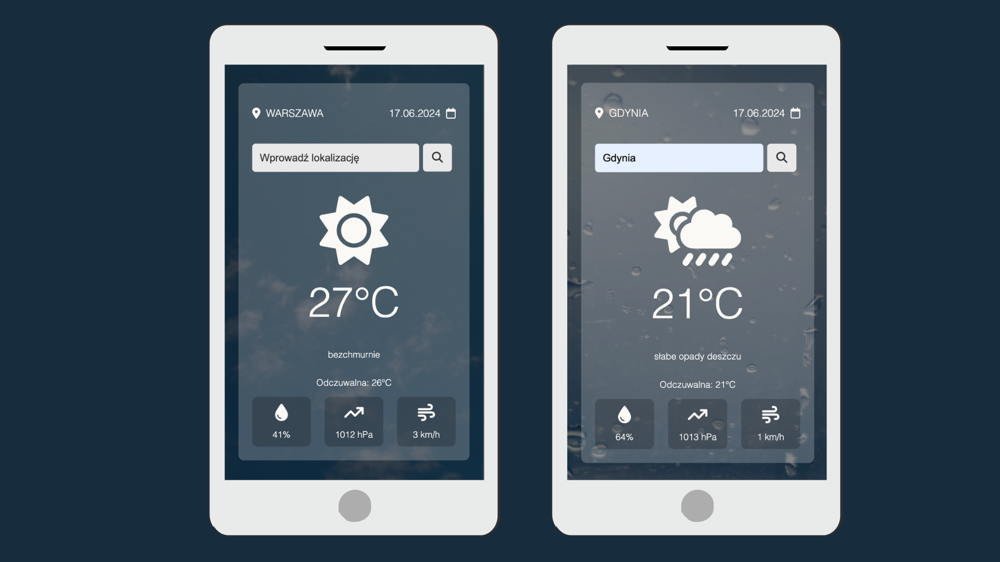

# Project - WEATHER APP

Weather application

Take a look at the following [description](#description) and [features](#features) of the project!

Click [this](https://martinafm.github.io/Weather-app/) link to see it live in your browser.

## Table of Contents

- [General info and description](#description)
- [Technologies Used](#technologies-used)
- [Features](#features)
- [Contact](#contact)

## Description

I used free [Open Weather Map API](https://openweathermap.org/) to create this project. I wanted the user to be able to search in this app by typing in a location. This kind of searching is still available for use and described [here](https://openweathermap.org/current#geocoding), but unfortunately that API requests by city name, zip-codes and city id have been deprecated.

## Technologies Used

- HTML5
- CSS3
- SASS
- JavaScript
- JSON
- free API
- Font Awesome Icons

## Features

- ability to search weather by city name
- search results are in Polish (parameter lang)
- unit temperature adjusted to Celcius (by default unit is Kalvin)
- project shows current temperature, feels like temperature, humidity, pressure, wind speed
- background and weather icon change according to weather conditions
- error handling
- additionally project shows also current date
- follows Mobile First rule
- fully responsive

## Contact

Thanks for looking in here, see you :)
